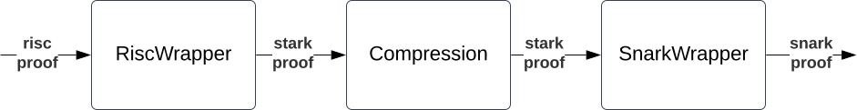

# zkos-wrapper
Library for verifying zkos with boojum

It takes the zkos proof (in json format), and returns the snark proof going through the following steps:

## Docs

See the [docs](./docs/README.md).

## Security

See [SECURITY.md](./SECURITY.md).

## License

Licensed under either of

 * Apache License, Version 2.0, ([LICENSE-APACHE](LICENSE-APACHE) or http://www.apache.org/licenses/LICENSE-2.0)
 * MIT license ([LICENSE-MIT](LICENSE-MIT) or http://opensource.org/licenses/MIT)

at your option.

### Contribution

See [CONTRIBUTING.md](./CONTRIBUTING.md).